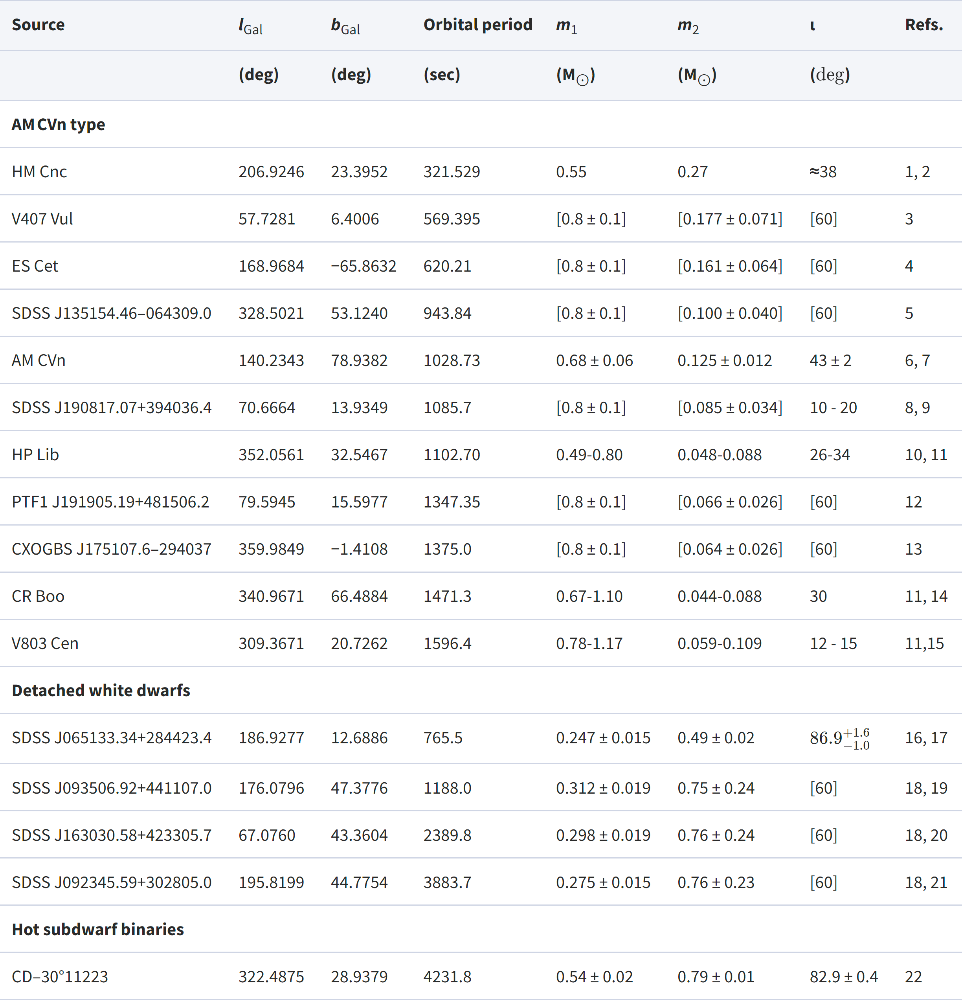
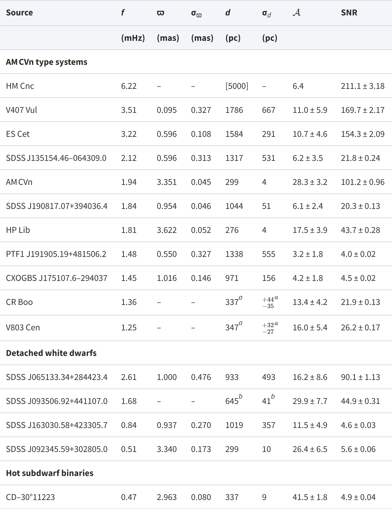

```{r setup, include=FALSE}
knitr::opts_chunk$set(echo = FALSE, warning = FALSE, message = FALSE)
library(kableExtra)
```


## Background. <span class="m22"> Gravitational Waves </span>

**Definition.** Gravitational waves are invisible distortions in spacetime, caused by massive events such as collisions between two black holes or neutron stars.

The importance of studying gravitational waveforms stems from the idea of detecting and using gravity to estimate other dynamical astrophysical phenomena, giving enormous potential for discovering parts of the universe that are invisible to the eye, such as black holes and other unknowns. 


#### GravityPy

> GravityPy is a Python package designed to simulate, detect, and analyze continuous gravitational wave-forms. 


GravityPy is a Python package for simulating the gravitational waveforms of binary mergers of black holes and neutron stars, computing several properties of these mergers and waveforms, and evaluating their detectability. In addition, GravityPy also takes in observed data from gravitational wave detectors to compare data and predict detection rates. 


---


## Data Description


> GravityPy uses simulated data for gravitational waves and observations from detectors such as the Laser Interferometer Space Antenna (LISA).


#### Simulated Data 

We obtain the simulated data by implementing the package functions for constructing simulations of gravitational waveform signals from a binary merger of two black holes or two neutron stars and outputting the data of such signals in terms of frequency and strain amplitude. 

```python
i_amp = ins.inspiral_strain_amplitude(i_Aorth, i_Adiag)
i_freq = mat.frequency_SI_units(i_m_omega, M)
```


```{r, fig.cap="Simulated Data Example"}
df <- read.csv("assets/data/out.csv")
kable(head(df, 8), col.names = c("Strain Amplitude", "Frequency"), escape = FALSE) %>%
  kable_styling(full_width = FALSE, font_size = 15, html_font = "Roboto Condensed", bootstrap_options = c("striped", "hover"))
```


---

#### Observed Data

The observed data contains LISA-validated binaries obtained from Kupfer et al. 2018 Tables 1 and 2. These observations are preloaded to the package and used to help generate the Source class based on these provided binaries.


```{r, fig.cap=c("Table 1. Physical properties of the known verification binaries", "Table 2. Measured EM properties and derived GW parameters"), out.width="40%", fig.show='hold'}


```

```{r}
table1 <- read.csv("assets/data/table1.csv")
table2 <- read.csv("assets/data/table2.csv")

```


**Limitations:** Both simulated and observed calculations apply a low-order post-Newtonian description of gravitational wave emission, meaning that the data do not account for higher-order effects.


https://academic.oup.com/mnras/article/480/1/302/5037945


---


## Use Cases

With this package, users can


- Simulate the gravitational waveform signal from the binary merger of two black holes or two neutron stars, and output the frequency and strain amplitude data for that signal.

- Evolve the orbits of binaries and calculate their strain amplitudes given any range of frequency harmonics.

- Calculate the sensitivity curve of a gravitational wave detector, which can calculate the signal-to-noise ratio (SNR) of the source ensemble.

- Calculate the horizon distance (maximum distance at which an event could be observed) for a gravitational wave model and a given detector.


---


## Demo 1. <span class="m22"> Single source SNR calculation </span>


The most basic use case for GravityPy is to calculate the signal-to-noise ratio of a single stellar-mass binary system. Using the package's source module, we first generate a source class and then calculate its SNR (for a 4-year mission by default).


```python
import GravityPy as gp
import astropy.units as u

source = gp.source.Source(m_1 = 10 * u.Msun,
                          m_2 = 10 * u.Msun,
                          ecc = 0.2,
                          f_orb = 1e-4 * u.Hz,
                          dist = 8 * u.kpc,
                          interpolate_g = False)
                          
source.get_snr()
```

For this example, GravityPy checks whether the source is eccentric/circular and evolving/stationary, and chooses the fastest method to accurately calculate the SNR, returning the value `array([4.49])`. 


---

## Demo 2. <span class="m22"> Multiple source SNR calculate</span>

In the next example, we use GravityPy to calculate the detectability of a collection of sources. We first import the package, then create a random set of possible LISA sources.


```python
import GravityPy.source as source
import numpy as np
import astropy.units as u

# create a random collection of sources
n_values = 1500
m_1 = np.random.uniform(0, 10, n_values) * u.Msun
m_2 = np.random.uniform(0, 10, n_values) * u.Msun
dist = np.random.normal(8, 1.5, n_values) * u.kpc
f_orb = 10**(-5 * np.random.power(3, n_values)) * u.Hz
ecc = 1 - np.random.power(5, n_values)
```


Using these random sources, we can instantiate a Source class.

```python
sources = source.Source(m_1 = m_1, m_2 = m_2, ecc = ecc, dist = dist, f_orb = f_orb)
```

---

Now, we can calculate the SNR (signal-to-noise ratio) for these sources. This function splits the sources based on whether they are stationary/evolving and circular/eccentric.


```python
snr = sources.get_snr(verbose=True)
```

<div class="blockquote2">
Calculating SNR for 1500 sources
        0 sources have already merged
        1385 sources are stationary
                427 sources are stationary and circular
                958 sources are stationary and eccentric
        115 sources are evolving
                33 sources are evolving and circular
                82 sources are evolving and eccentric
</div>

These SNR values are now stored in sources.snr and we can mask those that don’t meet some detectable threshold.

```python
detectable_threshold = 7
detectable_sources = sources.snr > 7
print("{} of the {} sources are detectable".format(len(sources.snr[detectable_sources]), n_values))
```

<div class="blockquote2">
585 of the 1500 sources are detectable
</div>


---


## Design 

The GravityPy package consists of four modules, each focusing on a specific aspect of computation related to gravitational wave sources that can be simulated or detected by space-based detectors. 


#### Modules:


1. **source.py**

The source module is the central module of the package, which provides a simple interface to the functions in the remaining modules. This module contains the Source class for analyzing a generic set of gravitational wave sources, stationary/evolving and circular/eccentric. 


```python
class Source():
    """Class for generic GW sources"""

    def __init__(self, m_1, m_2, ecc, dist, n_proc = 1, 
    f_orb = None, a = None, position = None, polarisation = None, inclination = None, weights = None, gw_lum_tol = 0.05, stat_tol = 1e-2, interpolate_g=True, interpolate_sc = True, sc_params = {}): 
    
    ## Code goes here
    
```

---

2. **utils.py**

The utils module is a collection of miscellaneous utility functions, such as conversions between variables, chirp mass, orbital frequency, and constants and expressions from the Peters equation (1964).

- Chirp mass (m_c) 
- Relative power of gravitational radiation at nth harmonic (g(n, e) from Peters and Matthews (1963) Eq. 20)
- Enhancement factor (f(e) from Peters and Mathews (1963) Eq.17)
- Orbital frequency (f_orb)
                
                
3. **vis.py**

The visualization module contains several wrappers, such as matplotlib, for plotting 1- and 2-dimensional distributions with histograms, scatter plots, and more for quick analysis of a collection of sources. In addition, it plots the LISA sensitivity curve.

- 1D distribution of source
- 2D distribution of source
- LISA sensitivity curve
    
     
     


                 
---


## Project Structure

The structure of the GravityPy github repository is as follows:


* docs/
  * index.html
  * present.Rmd
* examples/
  * 01_simulate_gravitational_waves.py
  * 02_calculate_SNR.py
  * 03_horizon_distance.py
* gravitational-waves/
  * tests/
    * test_inspiral.py
    * test_source.py
    * test_utils.py
    * test_visualization.py
    * __init__.py
  * inspiral.py
  * source.py
  * utils.py
  * visualization.py
  * __init__.py
* LICENSE
* README.md
* setup.py


- **README.md** : file gives an overview of the project
- **LICENSE** : open source MIT License
- **setup.py** : file initializes the project after it has been cloned
- **docs** : folder contains documentation (including the functional specification, design specification, and final project presentation)
- **GravityPy** : python package folder that is structured as one or more python modules (e.g., with init.py files) and test files
    - **__init__.py** 
    - **source.py** : module 
    - **utils.py** : module
    - **visualization.py** : module
    - **tests** : folder contains test files for the modules 
- **examples** : folder contains examples of using the packages
    - 01_simulate_gravitational_waves.py
    - 02_calculate_SNR.py
    - 03_horizon_distance.py


README.rst
LICENSE
setup.py
requirements.txt
sample/__init__.py
sample/core.py
sample/helpers.py
docs/conf.py
docs/index.rst
tests/test_basic.py
tests/test_advanced.py

---


## Lessons Learned 

Overall, this project taught me how to structure a Python project. Structuring GravityPy means making decisions about how the project can best achieve its goals: simulating, analyzing, and detecting gravitational waves. In other words, the structure requires writing clean code, with clear logic and dependencies, and organizing files and folders in the file system. Writing clean code with clear logic is part of the architectural task of building out the different components of a project and their interactions. Organizing a project requires making decisions, such as which features should go into a module, how data should flow through the project, and which features and functionality should be grouped together. 


By structuring the Python project, I learned how to divide the code base into clean, efficient modules using packages. This step requires building modules as an abstraction layer to divide the code into sections containing related data and functionality. For example, this project separates the layers that deal with plotting results from the layers that deal with miscellaneous utility functions by grouping all plotting functions in the visualization module and all utility functions in the utils module. Overall, the straightforward module importing model and packaging system provided in Python makes it notably easier to structure a Python package. 


---


## Future work


Overall, GravityPy is designed to help calculate binary sources of gravitational waves, whether simulated or LISA-like. This package aims to provide a way to study and better understand the detectability of such compact object binaries. Future work includes adding more functions, equations, and modules to the package to implement and analyze gravitational-wave emission, gravitational wave strain, SNR, and visualization modules, and see these implementations' effect on orbital evolution. This will require adding more modules and functions to compute higher-level linear algebra-based equations and mathematical models.


